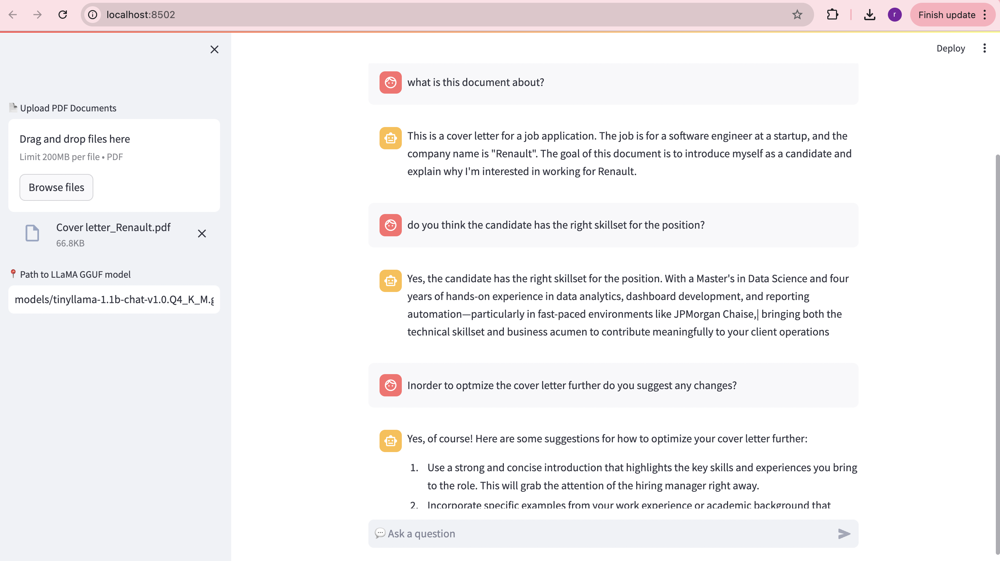

# Retrieval Augmented Generation Engine using LangChain, Streamlit


## Overview

The Retrieval Augmented Engine (RAG) is a powerful tool for document retrieval, summarization, and interactive question-answering. This project utilizes LangChain, Streamlit to provide a seamless web application for users to perform these tasks. With RAG, you can easily upload multiple PDF documents, generate vector embeddings for text within these documents, and perform conversational interactions with the documents. The chat history is also remembered for a more interactive experience.


### Example Output



## 🚀 Features

- 🔍 Ask questions from uploaded PDFs (private, offline)
- 🤖 Uses TinyLLaMA via `llama.cpp` for local inference
- 📄 Upload and embed PDF files into ChromaDB
- 🔗 Uses `LangChain` ConversationalRetrievalChain
- 🧠 Sentence Transformers (`all-MiniLM-L6-v2`) for embeddings
- 💬 Real-time QA via chat interface (Streamlit UI)


## Prerequisites

Before running the project, make sure you have the following prerequisites:

- Python 3.7+
- LangChain
- Streamlit
- PDF documents to upload

## Usage

1. Clone the repository to your local machine:

```bash
git clone https://github.com/ramdheeraj33/RAG-Langchain.git
cd RAG-Langchain
```

2. Install the required dependencies by running:
   ```bash
   pip install -r requirements.txt
   ```

3. Run the Streamlit app:
   ```bash
   streamlit run src/rag_engine.py
   ```

4. Access the app by opening a web browser and navigating to the provided URL.

5. Upload the PDF documents you want to analyze.

6. Click the "Submit Documents" button to process the documents and generate vector embeddings.

7. Engage in interactive conversations with the documents by typing your questions in the chat input box.

## Contributors

[Ram Dheeraj Kamarajugadda ](https://github.com/ramdheeraj33)

## Contact

If you have any questions, suggestions, or would like to discuss this project further, feel free to get in touch with me:

- [Email](mailto:ramdheerajk0310@gmail.com)
- [LinkedIn](https://linkedin.com/in/ram-dheeraj/)

I'm open to collaboration and would be happy to connect!